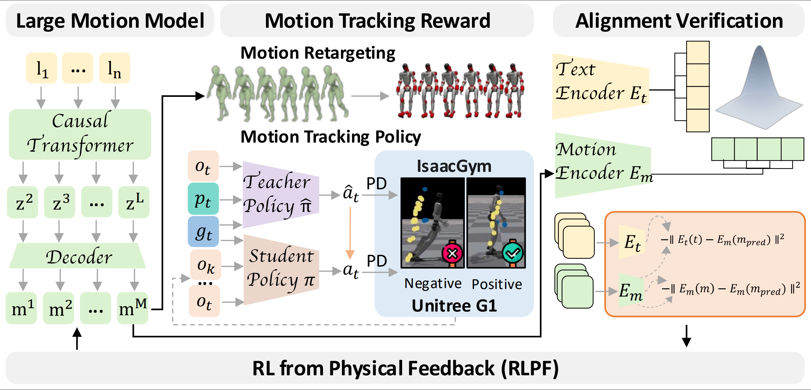

# RL from Physical Feedback: Aligning Large Motion Models with Humanoid Control

<div align="center">

[[Website]](https://beingbeyond.github.io/RLPF)
[[arXiv]](https://arxiv.org/abs/2506.12769)

[]()
[]()



</div>

We propose **Reinforcement Learning from Physical Feedback (RLPF)**, a novel framework that integrates physics-aware motion evaluation with text-conditioned motion generation. RLPF employs a motion tracking policy to assess feasibility in a physics simulator, generating rewards for fine-tuning the motion generator. This joint optimization ensures both physical plausibility and instruction alignment. Furthermore, RLPF introduces an alignment verification module to preserve semantic fidelity to text instructions. Extensive experiments show that RLPF outperforms baseline methods in generating physically feasible motions, enabling successful deployment on real humanoid platforms. Videos can be found on our [[Website]](https://beingbeyond.github.io/RLPF).

## Code
We will release our code soon.

## Citation
If you find our work useful, please consider citing us!
```
@article{yue2025rl,
title={RL from Physical Feedback: Aligning Large Motion Models with Humanoid Control},
author={Junpeng Yue, Zepeng Wang, Yuxuan Wang, Weishuai Zeng, Jiangxing Wang,
 Xinrun Xu, Yu Zhang, Sipeng Zheng, Ziluo Ding, Zongqing Lu},
journal={arXiv preprint arXiv:2506.12769},
year={2025}
}
```
