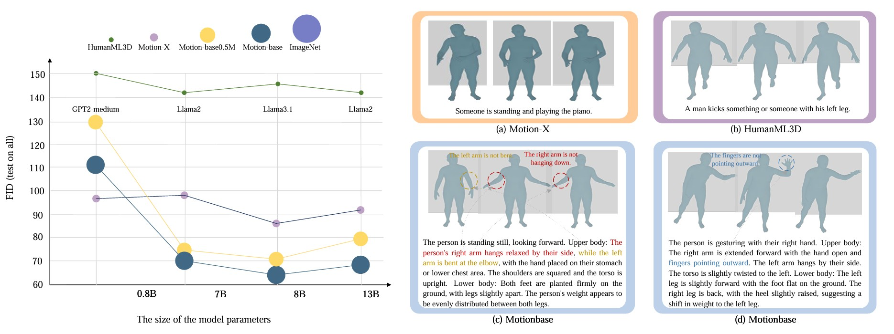

# MotionBase-0: Scaling Motion Generation Model with  Million-level Motion Benchmark

<div align="center">

[[Website]](https://beingbeyond.github.io/motionbase-0)
[[arXiv]](https://arxiv.org/abs/2410.03311)

[]()
[]()



</div>

We introduce MotionBase, the first large-scale motion generation benchmark containing over one million motions with detailed textual descriptions, significantly advancing the capability to effectively train motion generation models. More Visualization can be found on our [[Website]](https://beingbeyond.github.io/motionbase-0).


## Code
We will release our code and part of our dataset soon.

## Citation
If you find our work useful, please consider citing us!
```
@article{wang2024quo,
  title={Quo Vadis, Motion Generation? From Large Language Models to Large Motion Models},
  author={Wang, Ye and Zheng, Sipeng and Cao, Bin and Wei, Qianshan and Jin, Qin and Lu, Zongqing},
  journal={arXiv preprint arXiv:2410.03311},
  year={2024}
}
```
